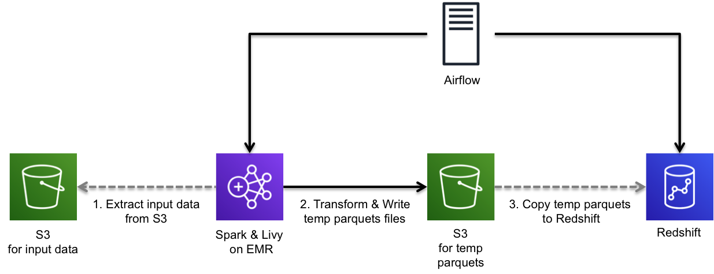

# yelp_dataset_analysis

ETL process to load/write Yelp dataset using various data processing tools

## Project Description

ETL process in this project will load [Yelp dataset](https://www.yelp.com/dataset/challenge) from S3 and copy data to Redshift for data analysis with SQL.

This project contains two ETL processes. These two ETL do exaclty same thing, but use different tools. The ETL using Jupyter Notebook is good for a small amount of data and the ETL using Airflow is good for a bigger amound of data.

## ETL process



This ETL follows the follow steps.

1. Airflow submits pyspark scripts to Spark cluster on EMR via Livy.
2. Spark reads input data from S3
3. Spark transforms data and write temp parquet files in S3.
4. Airflow requests `COPY` commands to Redshift to copy temp parquet files to Redshift.

## Getting started [Jupyter Notebook]

### Download Yelp dataset
You can download the data set from [Yelp Dataset Challenge](https://www.yelp.com/dataset/challenge). 

This ETL fetch data from `/yelp_dataset_sample` folder. Put the downloaded jsons in that folder or change the `data_folder` to the location of where your files are.
```
main_bucket = config.get("DATA_S3", "ETL_TEMP_S3_BUCKET")
data_folder = "yelp_dataset_sample/"
temp_bucket = main_bucket + "/temp/"
```

### Configuration

This ETL will read configurations from `/config.cfg`. You can find a sample configuration file from `/config.cfg.example`. The AWS authorization should have S3 read/write permissions.

## Getting started [Airflow Data Pipeline]

### Download Yelp dataset
This ETL will consume splited files one by one from S3. The file path should be `s3://<your-s3-bucket>/<original-file-name>/x<file-number>`.

For example, Here are filepaths to two business files in this dataset.
```
s3://<your-s3-bucket>/business/x00
s3://<your-s3-bucket>/business/x01
```

In my case, I splited each files into 100MB files.
```
split -d -b 100MB business.json
```

### Configuration

This ETL will read configurations from Airflow. You should import required variables to Airflow DB. You can find required variables from `airflow_variables.json.example`.  

This ETL also requires Redshift connections and S3 connections. You could find how to add connections in Airflow DB from here.
https://airflow.apache.org/howto/connection/index.html

The Redshift connection name should be `redshift` and the S3 connection name should be `s3`.

## Redshift Cluster

The ETL in Jupyter Notebook includes a step to create tables. You don't need to create tables manually.

The ETL in Airflow requires that tables are ready before processing ETL. You could either run `create_tables.sql` sql file in your database IDE or run `/redshift/create_tables.py` python file. Both sql and python files will read configrations from `config.cfg`

### Create a new Redshift cluster

You can create a redshift cluster using a script `/redshift/create_cluster.sh`. This script uses the AWS cli so that you need to configure AWS cli first.
https://docs.aws.amazon.com/cli/latest/reference/configure/

The script reads variables from `/redshift/export_env_variables.sh`. You can find necessary variables from `/redshift/export_env_variables.sh.example`.

## Spark(EMR) Cluster

The ETL in Jupyter Notebook uses the local Spark cluster. You should have Spark in the machine where the ETL script run.

The ETL in Airflow uses Spark cluster via Livy on EMR. The ETL process requires python3 and NLTK files. Bootstrap script and configurations for EMR are prepared under `\emr` folder. You can use those files by uploading S3.